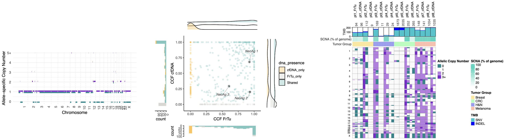

# Cell-free and tumor biopsy DNA analysis: CNA, variant clonality, phylogenetic trees and more

>Scripts used in the analysis included in the manuscript entitled:  
***Peripheral blood as the Sole Source for Cancer Neoantigen and reactive T cell discovery***
by Garcia-Garijo A et al. 2025

## CNA analysis
Identification of somatic copy number alterations from sequencing data, including segmentation and tumor purity estimation, using [ASCAT](https://github.com/VanLoo-lab/ascat).

> See [Readme](cna/README.md)

## Variant calling to counts 
Processing of variant calls (VCF) and alignment (bam) files, to generate read count tables per variant for downstream analyses.

> See [Readme](variant-counts/README.md)

## CCF / Variant copy number calculations
Estimation of cancer cell fraction (CCF) / variant copy numbers, using allele-specific copy numbers and purity-adjusted models.

> See [Readme](ccf/README.md)

## Phylogenetic clonal reconstruction
Inference of tumor clonal architecture and evolutionary relationships among subclones based on variant clustering performed with [CONIPHER](https://github.com/McGranahanLab/CONIPHER).

> See [Readme](phylo/README.md)

## Summary plots
Visualization of key outputs such as **tumor mutation burden**, **clonality**, and **copy number changes**.

> See [Readme](plots/README.md)

