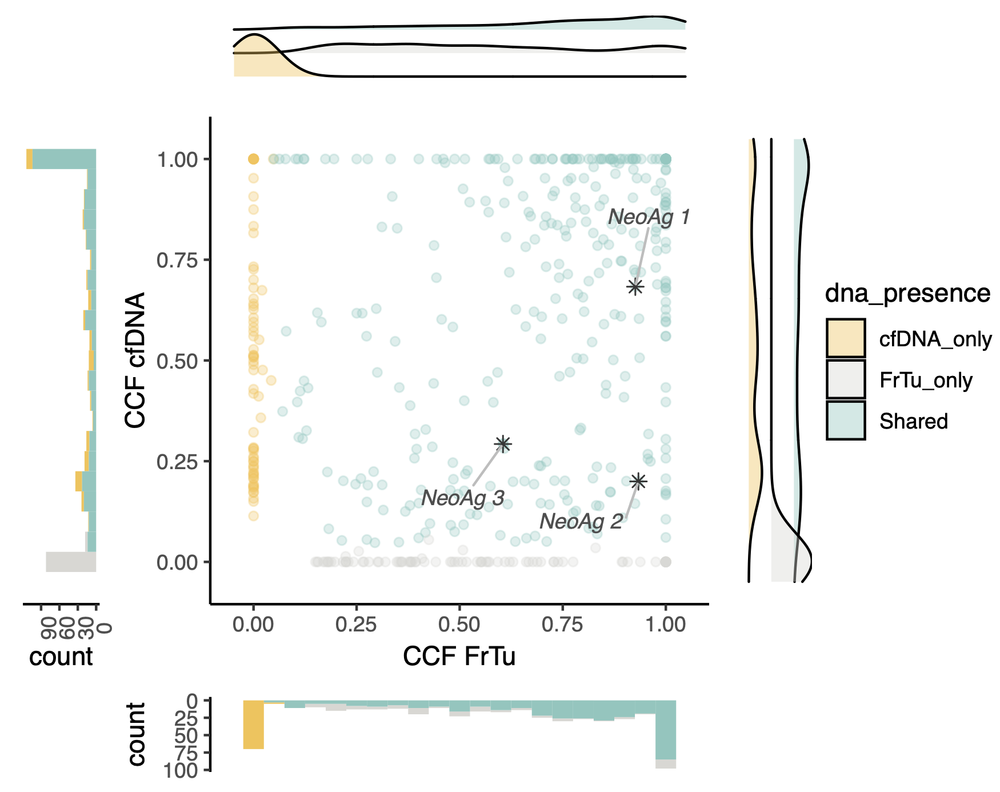

# R plotting functions

## CCF comparison plot
Compare CCF data from two different tumor samples (e.g. biopsy vs cfDNA)

```{r}
ccf_compare_plot <- function(
    ccf_tsv = "path/to/ccf_data.tsv", # output of ccf --version 2
    patient = "PatientID",
    dna_presence_criteria = "vaf", # vaf or alt_reads
    min_vaf = 0.01, # minimum VAF to consider a mutation present in a sample
    min_alt_reads = 1, # minimum ALT reads to consider a mutation present in a sample
    show_immunogenic = TRUE, # whether to highlight immunogenic mutations
    label_immunogenic = TRUE, # whether to label immunogenic mutations
    limit_ccf = TRUE # whether to limit CCF values to max 1
    )
```

### Example plot: with immunogenic mutations highlighted and labeled
NeoAg / immunogenic variants can be highlighted and labeled or not using the options `show_immunogenic` and `label_immunogenic`, respectively.



##