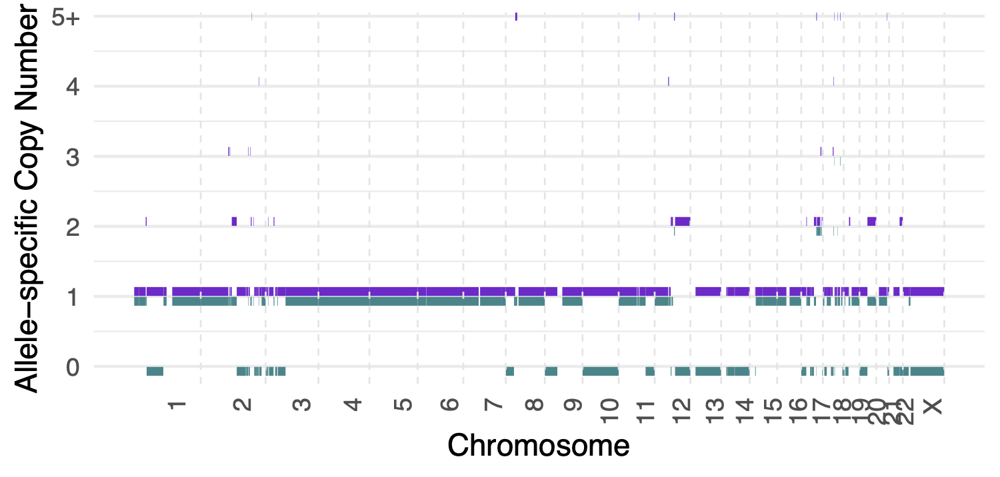
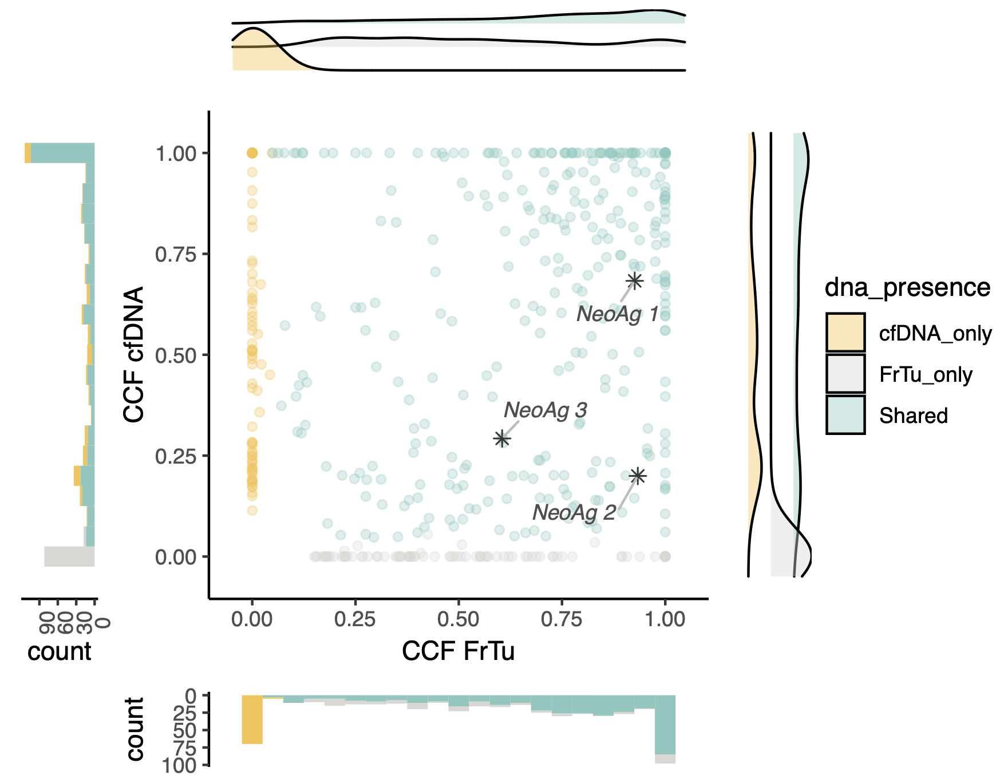
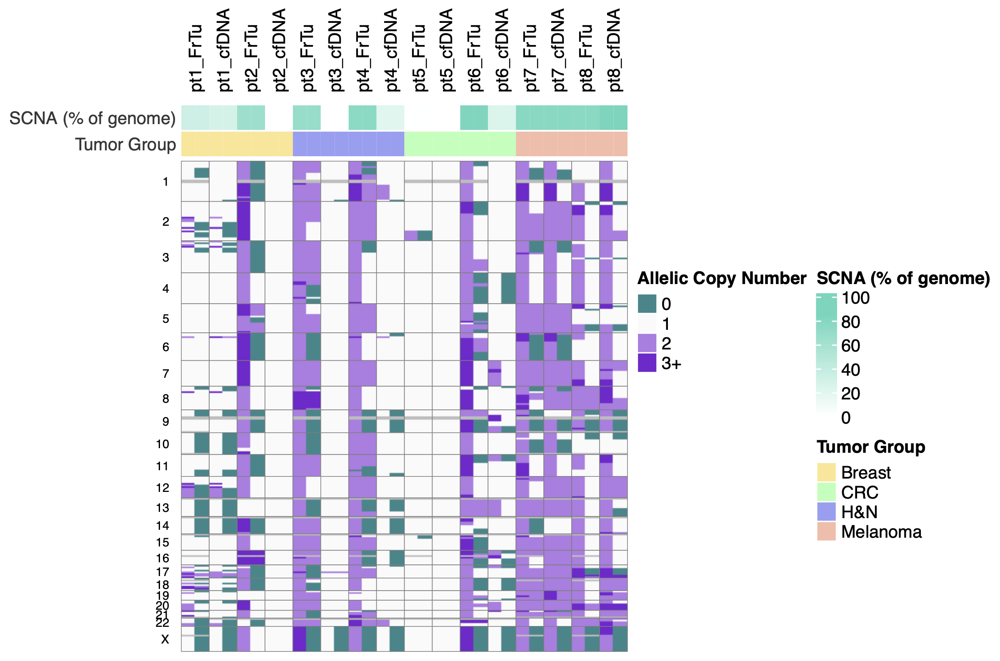
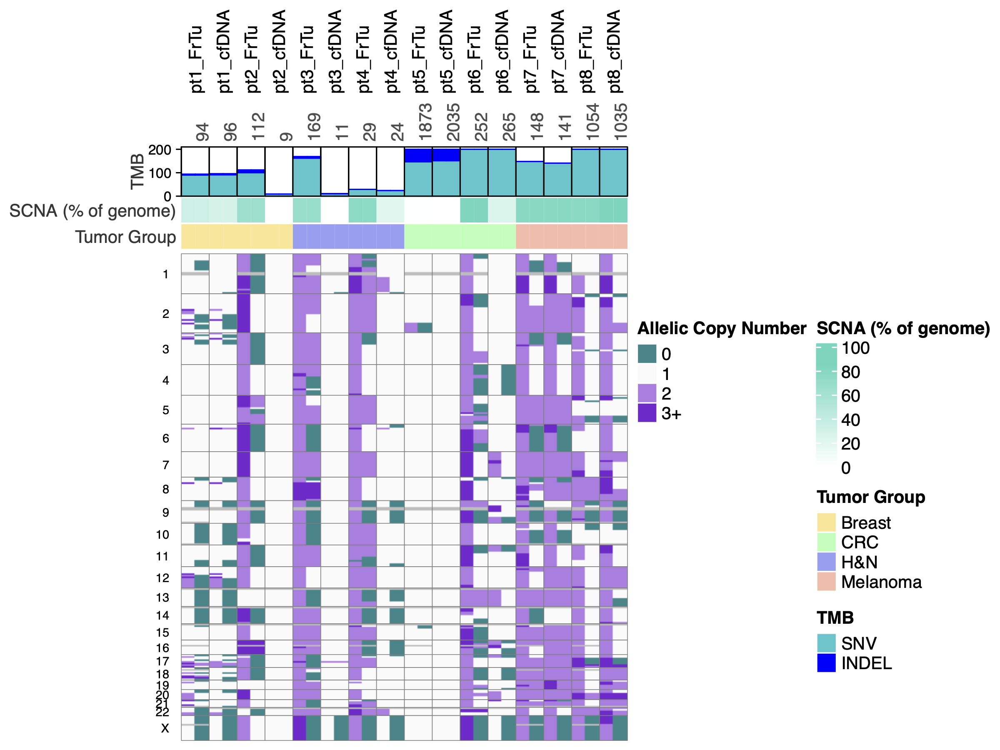

# How to use R plotting functions

## Load R functions
```r
source("plots.R")
```

## ASCAT segment plot
Customizable plotting of ASCAT `segments.txt` or `segments_raw.txt` output.

```r
plot_ascat_allelic_segments(
	segment_file = "path/to/segments.txt", # can be segments.txt or segments_raw.txt
	nmaj_color = "#7D26CD", # color of major copy number segments
    nmin_color = "#00868B", # color of minor copy number segments
    sample_id = NULL, # if segments.txt contains multiple samples, specify sample ID to plot
    exclude_chrXY = FALSE, # whether to exclude chromosomes X and Y from the plot
    min_seg_size = 1e6, # minimum segment size to plot (in bp)
    offset = 0.07, # vertical offset between nMajor and nMinor segments
    line_width = 1.5, # line width of segments
    cn_cap = 5 # maximum copy number to display (higher values will be capped)
	)
```
### Example plot
```r
pdf(file = "test_ascat_plot.pdf", width = 5, height = 2.4)
plot_ascat_allelic_segments(
	segment_file = "../test/cna/test_FrTu.segments_raw.txt",
    cn_cap = 5)
dev.off()
```



## CCF comparison plot
Compare CCF data from two different tumor samples (e.g. biopsy vs cfDNA)

```r
ccf_compare_plot(
    ccf_tsv = "path/to/ccf_data.tsv", # output of ccf --version 2
    patient = "PatientID",
    dna_presence_criteria = "vaf", # vaf for minimum tumor vaf criteria or alt_reads for minimum number of alt reads criteria
    min_vaf = 0.01, # minimum VAF to consider a mutation present in a sample (if dna_presence_criteria = "vaf")
    min_alt_reads = 1, # minimum ALT reads to consider a mutation present in a sample (if dna_presence_criteria = "alt_reads")
    show_immunogenic = TRUE, # whether to highlight immunogenic mutations
    label_immunogenic = TRUE, # whether to label immunogenic mutations (show gene name)
    limit_ccf = TRUE # whether to limit CCF values to max 1 (otherwise the variant copy number is shown and can be >1)
    )
```

### Example plot: with immunogenic mutations highlighted and labeled
**NeoAg / immunogenic variants** can be highlighted and labeled or not using the options `show_immunogenic` and `label_immunogenic`, respectively.

```r
pdf(file = "test_ccf_density_plot.pdf", width = 6, height = 5)
ccf_compare_plot(
	ccf_tsv = "../test/ccf/test_full_FrTu_cfDNA_all_mutations_CCF.tsv", 
	patient = "Test",
	)
dev.off()
```



## CNA heatmap
Generate a **heatmap of copy number alterations across multiple samples**.

Input is a CSV file with the following columns `sample,segments,nsm_snv,nsm_indel,tumor_type`

**Column explanations**: <br>
`sample`: Sample ID <br>
`segments`: Path to ASCAT `segments.txt` or `segments_raw.txt` file for the sample <br>
`nsm_snv` (**optional**): Number of somatic non-synonymous SNVs in the sample (for annotation) <br>
`nsm_indel` (**optional**): Number of somatic non-synonymous indels in the sample (for annotation) <br>
`tumor_type` (**optional**): Tumor type (for annotation)

```r
cna_heatmap(
    cna_input_csv, # path to input CSV file as described above
    tmb_annot = TRUE, # whether to include TMB annotation: ⚠️ nsm_snv and nsm_indel columns must be filled in input csv or missing values will be set to 0
    order_by = "input" # "input", "tmb" or "scna": order samples as in input csv, by TMB or by fraction of genome with SCNA, respectively
    )
```
### Example plot: without TMB annotations
```r
# Create test CNA heatmap without TMB annotations
set.seed(2025)
pdf("cna_heatmap_no_annot.pdf", width = 8, height = 5.3)
cna_heatmap(
	cna_input_csv = "../test/cna/heatmap/input.csv",
	tmb_annot = FALSE,
	)
dev.off()
```


### Example plot: with TMB annotations
```r
# Create test CNA heatmap with TMB annotations
set.seed(2025)
pdf("cna_heatmap.pdf", width = 8, height = 6)
cna_heatmap(
	cna_input_csv = "../test/cna/heatmap/input.csv",
	)
dev.off()
```
